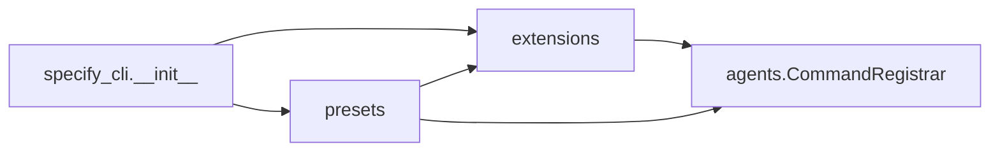
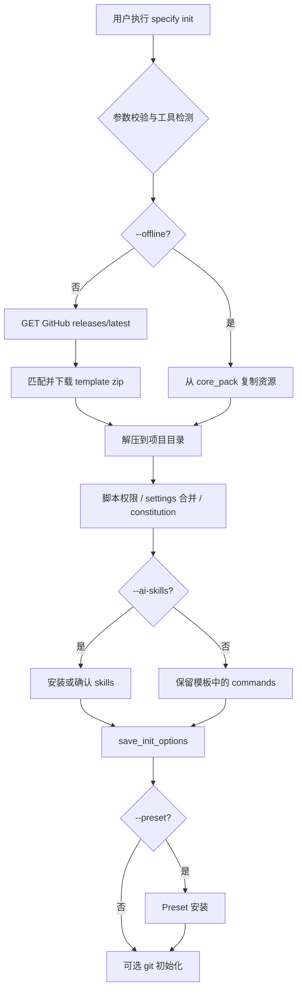

# 项目技术文档

## 1. 项目架构概览

- **项目类型与技术栈**：本仓库为 **Python 命令行工具库 + 规范驱动开发（SDD）资源集合**。核心可安装包为 `specify-cli`（`pyproject.toml` 中 `name = "specify-cli"`），入口脚本 `specify` → `specify_cli:main`。运行时依赖包括 **Typer**（CLI 框架）、**Rich**（终端 UI）、**httpx**（HTTP，含可选 SOCKS）、**PyYAML**、**json5**（JSONC）、**packaging**、**pathspec**、**platformdirs**、**readchar**、**truststore** 等。无内置 Web 服务或应用内数据库；项目脚手架与模板以文件形式落盘。
- **顶层架构模式**：**单包 CLI + 模块化子系统**。`specify_cli/__init__.py` 承载主命令（`init`、`check`、`version`）与子应用挂载（`extension`、`preset`）；扩展（`extensions.py`）、预设（`presets.py`）与智能体命令注册（`agents.py`）形成 **配置驱动 + 文件生成** 的工作流。初始化路径支持 **在线模式**（GitHub Release 资产）与 **离线模式**（wheel 内嵌 `core_pack`，由 Hatch `force-include` 打包）。
- **构建与部署**：**Hatchling** 构建 wheel；通过 `uv tool install` / `pip` 等分发 CLI。CI 见 `.github/workflows/`（测试、Lint、发布等）。发布脚本与模板包生成位于 `.github/workflows/scripts/` 及打包进 wheel 的 `release_scripts`。文档站点使用 DocFX（`docs/docfx.json`）。

---

## 2. 目录结构及其职责

| 目录路径 | 主要职责 | 包含的关键文件/子目录示例 |
| :--- | :--- | :--- |
| `src/specify_cli/` | **Specify CLI 实现**：`AGENT_CONFIG`、Typer 应用、`init`/`check`/`version`、GitHub 下载与解压、与扩展/预设命令的衔接 | `__init__.py`（主逻辑，体量最大）、`agents.py`、`extensions.py`、`presets.py`；打包后 wheel 内含 `core_pack/`（模板与脚本副本） |
| `templates/` | **上游模板源**：规范、计划、任务、宪章等 Markdown 模板及 `commands/` 下各 slash command 模板 | `spec-template.md`、`plan-template.md`、`templates/commands/*.md` |
| `scripts/bash/`、`scripts/powershell/` | **跨平台辅助脚本**：先决条件检查、功能分支、计划脚本、agent 上下文更新等；部分复制到 wheel 的 `core_pack` | `check-prerequisites.sh`、`update-agent-context.sh`、`create-new-feature.ps1` 等 |
| `tests/` | **pytest 测试**：CLI 行为、配置一致性、扩展/预设、合并与分支编号等 | `test_extensions.py`、`test_presets.py`、`test_agent_config_consistency.py` |
| `docs/` | **用户与开发文档**（DocFX / GitHub Pages） | `index.md`、`installation.md`、`quickstart.md`、`docfx.json` |
| `extensions/` | **扩展体系说明与目录**：官方/社区 catalog、扩展模板与 RFC | `catalog.json`、`EXTENSION-API-REFERENCE.md`、`template/extension.yml` |
| `presets/` | **预设包示例与 catalog**：可安装的模板集合（artifact/command/script） | `catalog.json`、`self-test/`、`scaffold/` |
| `.github/workflows/` | **自动化**：测试、Lint、发布、CodeQL 等 | `test.yml`、`release.yml`、`scripts/create-release-packages.sh` |
| `.devcontainer/` | **开发容器**：VS Code 扩展与 `post-create.sh` | `devcontainer.json` |
| 仓库根目录 | **元数据与约定** | `pyproject.toml`、`README.md`、`AGENTS.md`（智能体集成指南）、`spec-driven.md` |

---

## 3. 关键模块依赖关系图

**文字说明**：`specify_cli.__init__` 为 CLI 门面，直接依赖 Typer、Rich、httpx 及大量路径/子进程工具函数。`extensions` 模块实现扩展清单、注册表、安装与 **Hook** 执行，并在 `CommandRegistrar` 中 **委托** `agents.CommandRegistrar` 写入各 AI 工具目录下的命令文件。`presets` 模块实现预设清单、注册表、安装与模板解析，复用 `extensions.ExtensionRegistry` 与 `extensions.normalize_priority`（目录栈/优先级语义对齐），并在安装命令时调用 `agents.CommandRegistrar`。`agents.CommandRegistrar` 是智能体侧命令格式的 **单一实现**；`extensions.CommandRegistrar` 为其面向扩展的包装层。`__init__` 对 `presets`、`extensions` 多为 **命令处理函数内延迟导入**，以降低启动耦合。

---

## 4. 核心类与接口功能说明

| 名称 | 类型 (类/接口/抽象类) | 所在包/模块 | 核心职责与功能简述 |
| :--- | :--- | :--- | :--- |
| `app` / `BannerGroup` | Typer 应用与自定义 Group | `specify_cli.__init__` | 根 CLI：`init`、`check`、`version`；挂载 `extension`、`preset`；无子命令时展示 Banner |
| `AGENT_CONFIG` | 模块级字典（元数据注册表） | `specify_cli.__init__` | 各 AI 助手键名（与可执行文件名对齐，如 `cursor-agent`）、目录、`commands_subdir`、`requires_cli` 等 **单一事实来源** |
| `StepTracker` | 类 | `specify_cli.__init__` | 初始化/检查等长流程的步骤树状态与 Rich 渲染 |
| `download_template_from_github` / `download_and_extract_template` | 函数 | `specify_cli.__init__` | 调用 GitHub API 取 latest release，匹配 `spec-kit-template-{ai}-{sh|ps}.zip`，下载并解压到目标项目 |
| `scaffold_from_core_pack` | 函数 | `specify_cli.__init__` | `--offline` 时从 wheel 内 `core_pack`（或源码回退路径）复制模板与脚本 |
| `CommandRegistrar` | 类 | `specify_cli.agents` | 解析/渲染 Markdown 与 TOML 命令、按智能体目录约定注册/反注册命令文件（含 Copilot 等特例） |
| `CommandRegistrar` | 类 | `specify_cli.extensions` | 对 `agents.CommandRegistrar` 的包装，为扩展命令注入扩展 ID/配置路径注释 |
| `ExtensionManifest` / `ExtensionRegistry` / `ExtensionManager` | 类 | `specify_cli.extensions` | 校验 `extension.yml`、持久化已装扩展、安装 ZIP/目录、卸载、与命令注册联动 |
| `ExtensionCatalog` | 类 | `specify_cli.extensions` | 拉取与缓存 `catalog.json`（及社区 catalog）、搜索与下载扩展包 |
| `HookExecutor` | 类 | `specify_cli.extensions` | 读取/保存 `.specify` 下扩展配置，按 manifest 执行钩子 |
| `PresetManifest` / `PresetRegistry` / `PresetManager` | 类 | `specify_cli.presets` | 校验 `preset.yml`、安装模板到项目、与 CLI 初始化 `--preset` 衔接 |
| `PresetCatalog` / `PresetResolver` | 类 | `specify_cli.presets` | 预设 catalog 管理与模板解析顺序（含优先级） |

---

## 5. 核心数据流向图

### 5.1 `specify init`（默认：从 GitHub 获取模板）

1. 解析参数（项目名 / `--here`、`--ai`、`--script`、`--offline`、`--preset` 等），校验智能体与 `generic` 的 `--ai-commands-dir` 规则。  
2. 可选检查 `git` 与 `requires_cli` 的智能体可执行文件。  
3. **在线路径**：`httpx` **GET** `https://api.github.com/repos/github/spec-kit/releases/latest`（可选 `Authorization: Bearer`），解析 `assets`，选取匹配 zip；再 **流式 GET** `browser_download_url` 下载到临时/工作目录。  
4. 解压至目标项目路径，处理脚本可执行位、`.vscode/settings.json` 合并（json5）、宪章模板等。  
5. 若 `--ai-skills`：安装或确认 bundled skills，并可能在全新目录下删除冗余 commands 目录。  
6. `save_init_options` 将初始化选项写入项目（供后续 preset 等使用）。  
7. 若指定 `--preset`：`PresetManager` / `PresetCatalog` 从本地目录或 catalog 安装。  
8. 可选 `git init` + 初次提交；输出后续 slash command / skills 使用说明。

### 5.2 `specify extension add`（概要）

1. 在当前项目（需存在 `.specify/`）解析扩展 ID。  
2. `ExtensionCatalog` 获取/缓存 catalog，下载扩展 zip。  
3. `ExtensionManager.install_from_zip` 校验 manifest、解压、更新 `ExtensionRegistry`。  
4. `extensions.CommandRegistrar` 委托 `agents.CommandRegistrar` 向各 agent 目录写入命令；`HookExecutor` 更新钩子配置。

---

## 6. API接口清单

本项目 **不提供面向用户的 HTTP REST API**。以下表格 **（一）** 列出 **CLI 命令接口**（主用户界面）；**（二）** 列出 CLI 在运行时访问的 **外部 HTTP 资源**（实现细节，供排查网络/鉴权问题）。

### （一）CLI 命令

| 请求方法 | 端点路径 | 功能描述 | 主要请求/响应体 |
| :--- | :--- | :--- | :--- |
| CLI | `specify` / `specify --help` | 显示 Banner 与帮助 | 无请求体；标准输出为帮助文本 |
| CLI | `specify init [PROJECT_NAME] [选项…]` | 初始化 SDD 项目：下载或离线脚手架、可选 git、预设、skills | 选项：`--ai`、`--here`、`--script`、`--offline`、`--preset`、`--ai-skills`、`--github-token` 等；结果为文件系统变更与终端输出 |
| CLI | `specify check` | 检测 git、各 `requires_cli` 智能体 CLI、VS Code 可执行文件等 | 无；表格化状态输出 |
| CLI | `specify version` | 显示 CLI 版本、模板 Release 信息、Python 与平台信息 | 内部 GET GitHub latest release（见下表） |
| CLI | `specify preset list` | 列出已安装预设 | 无 |
| CLI | `specify preset add …` | 从目录或 catalog 添加预设 | 参数依实现（URL/ID 等，见 `--help`） |
| CLI | `specify preset remove …` | 移除预设 | 预设 ID/名称 |
| CLI | `specify preset search …` | 搜索 catalog | 查询字符串 |
| CLI | `specify preset resolve …` | 解析模板解析顺序 | 解析相关参数 |
| CLI | `specify preset info …` | 预设详情 | 预设 ID |
| CLI | `specify preset set-priority …` | 调整预设优先级 | ID + 整数优先级 |
| CLI | `specify preset enable` / `disable` | 启用/禁用预设 | 预设 ID 或名称 |
| CLI | `specify preset catalog list` / `add` / `remove` | 管理预设 catalog 栈 | URL 或名称等 |
| CLI | `specify extension list` | 列出已安装扩展 | 无 |
| CLI | `specify extension add …` | 安装扩展 | 扩展 ID 等 |
| CLI | `specify extension remove …` | 卸载扩展 | 扩展 ID |
| CLI | `specify extension search …` | 搜索扩展 catalog | 查询字符串 |
| CLI | `specify extension info …` | 扩展详情 | 扩展 ID |
| CLI | `specify extension update …` | 自 catalog 更新扩展（含失败回滚逻辑） | 扩展 ID |
| CLI | `specify extension enable` / `disable` | 启用/禁用扩展（同步 hooks） | 扩展 ID 或名称 |
| CLI | `specify extension set-priority …` | 扩展优先级 | ID + 整数 |
| CLI | `specify extension catalog list` / `add` / `remove` | 管理扩展 catalog 栈 | URL 或名称等 |

### （二）CLI 内部调用的主要 HTTP 接口

| 请求方法 | 端点路径 | 功能描述 | 主要请求/响应体 |
| :--- | :--- | :--- | :--- |
| GET | `https://api.github.com/repos/github/spec-kit/releases/latest` | 获取最新 Release 元数据与 `assets` 列表 | 可选 Header：`Authorization: Bearer <token>`；响应 JSON 含 `tag_name`、`assets[].name`、`browser_download_url` |
| GET | `assets[].browser_download_url` | 下载对应 `spec-kit-template-*` zip | 流式响应体为 zip 二进制 |
| GET | `ExtensionCatalog.DEFAULT_CATALOG_URL` 等 | 拉取扩展 catalog（raw GitHub JSON） | JSON catalog |
| GET | `PresetCatalog` 配置的预设 catalog URL | 拉取预设 catalog | JSON catalog |

---

## 7. 常见的代码模式与约定

- **设计模式应用**  
  - **注册表 / 元数据驱动**：`AGENT_CONFIG`、扩展与预设的 manifest（`extension.yml` / `preset.yml`）驱动安装与文件布局。  
  - **外观（Facade）**：`__init__.py` 中 Typer 命令聚合复杂子流程。  
  - **委托（Delegate）**：`extensions.CommandRegistrar` 委托 `agents.CommandRegistrar`。  
  - **策略差异**：按智能体选择 Markdown vs TOML、目录名（`commands` / `skills` / `prompts` 等）由配置表分支。  
  - **资源打包**：Hatch `force-include` 将模板与脚本 **静态打入 wheel**，支持离线与企业环境。

- **项目特定约定**  
  - **命名规范**：可执行 CLI 名为 `specify`；包名 `specify-cli`；`AGENT_CONFIG` 的 **字典键必须与真实 CLI 可执行名一致**（如 `cursor-agent`），以便 `shutil.which` 检测。扩展命令名需符合 `speckit.<ext>.<cmd>`（见 `ExtensionManifest` 校验）。  
  - **目录组织习惯**：用户项目侧使用 `.specify/` 存放扩展注册与配置；各 AI 工具使用点目录（如 `.claude/commands/`）。源码中 `templates/` 与 `scripts/` 与 `core_pack` 镜像关系由 `pyproject.toml` 声明。  
  - **配置管理**：扩展/预设版本兼容使用 **packaging** 的 `SpecifierSet`；项目内 JSON 合并使用 **json5** 以容忍 JSONC。GitHub 鉴权优先 CLI `--github-token`，否则环境变量 `GH_TOKEN` / `GITHUB_TOKEN`。  
  - **通用工具类**：跨平台脚本与发布逻辑在 `scripts/bash`、`scripts/powershell` 及 wheel 内 `core_pack` 副本；网络与 SSL 使用 **truststore** 注入的 `SSLContext` 与 **httpx** 客户端。
